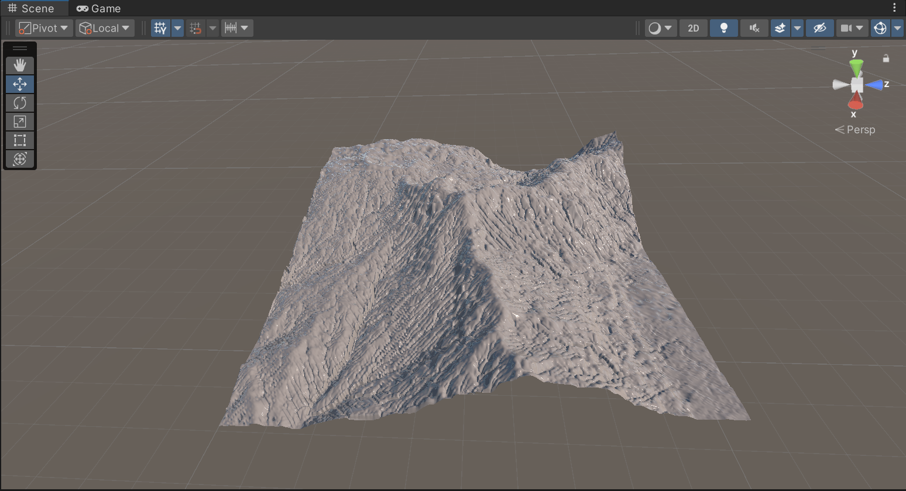
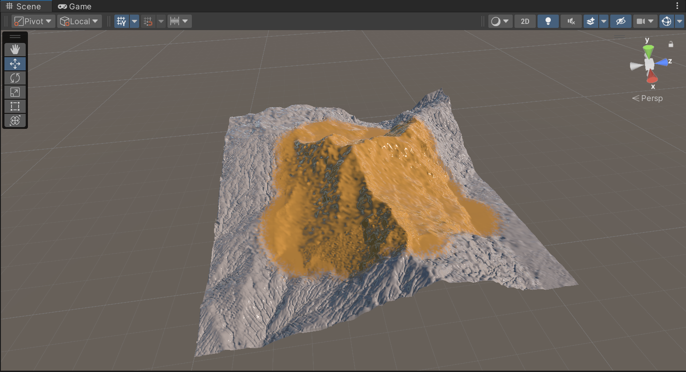
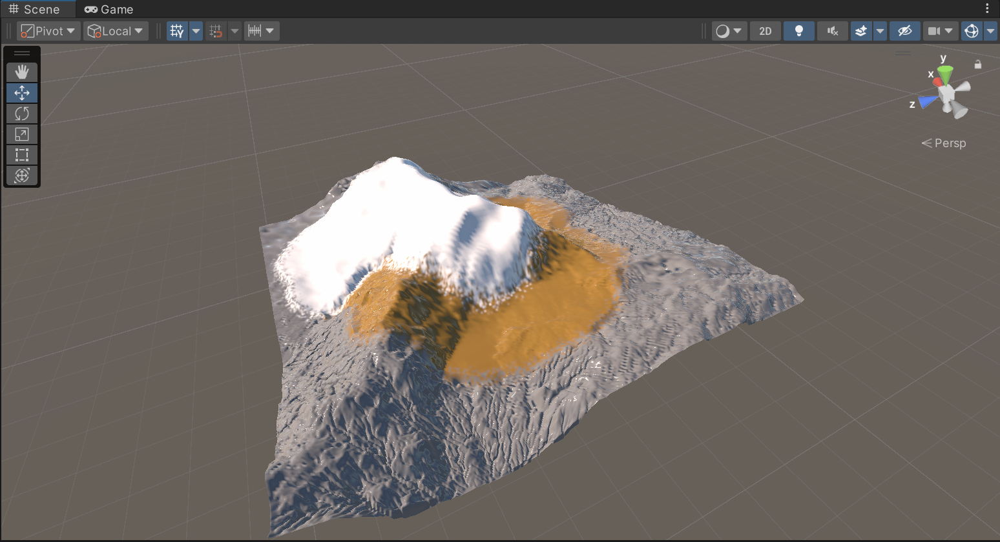
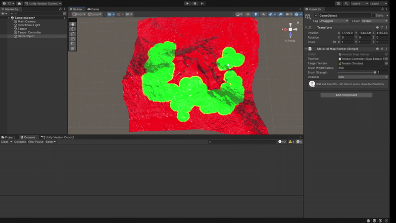

# GPU Terrain Amplification with Multi-Scale Erosion

University of Pennsylvania

[Zixiao Wang](https://www.linkedin.com/in/zixiao-wang-826a5a255/), [Tianhong Zhou](https://www.linkedin.com/in/tianhong-zhou-b559aa159/)


### Overview
High-resolution, hydrologically consistent terrains are expensive to author by hand and slow to simulate at full resolution. [Terrain Amplification using Multi-scale Erosion](https://hal.science/hal-04565030/document) (SIGGRAPH 2024) proposes a fast pipeline that amplifies a coarse DEM into a detailed terrain across scales while keeping drainage networks realistic. This project implements a fully GPU-accelerated reproduction of the amplification algorithm and extends it with material-aware erosion, real-time material painting, and full Unity Terrain integration.

The system processes a low-resolution terrain (e.g., 256×256) and amplifies it to high resolution (2048×2048) by applying physically inspired erosion models across multiple scales:
```
T_{k+1} = D_k ∘ T_k ∘ E_k ∘ U_k (T_k)
```
We implemented all major algorithmic components as GPU compute kernels, coordinated by a multiscale pipeline controller.


### Project Structure
```
/Assets
   /Shaders
       Erosion.compute
   /Scripts
       GpuTerrainPipeline.cs
       MaterialMapPainter.cs
       GenerateBandMaterialMaps.cs
       TerrainMaterialUtils.cs
```

### Core Pipeline
Each level performs:
  - Upsampling (Uk)
  - Flow Routing
    ```
    [numthreads(8,8,1)]
    void FlowRouting(uint2 id : SV_DispatchThreadID)
    {
        float h = _InHeightRT[id];

        float slopes[8];
        float sum = 0;

        for(int i=0; i<8; i++)
        {
            float nei = SampleHeight(id + next8[i]);
            float s = max(0, h - nei);
            slopes[i] = pow(s, _FlowP);
            sum += slopes[i];
        }

        float flow = 0;
        for(int i=0; i<8; i++)
            flow += slopes[i] / max(sum, 1e-5);

        _OutStreamRT[id] = flow;
    }

    ```
  - Stream-Power Erosion (Ek)
    ```
    float drainage = _StreamRT[id];
    float slope    = ComputeSlope(id);

    float e = pow(slope, n) * pow(drainage, m);

    e = min(e, _MaxSlopeN * _MaxDrainM);

    float dh = _ErosionDT * kE * e;
    _OutHeightRT[id] = _InHeightRT[id] - dh;
    ```
  - Thermal Erosion (Tk)
    ```
    float s = ComputeSlopeMagnitude(id);

    if(s > talus)
    {
        float amt = (s - talus) * _ThermalDT;
        _TempRT[id] = _InHeightRT[id] - amt;
    }
    else
        _TempRT[id] = _InHeightRT[id];
    ```
  - Sediment Deposition (Dk)
    ```
    float sediment = _SedimentRT[id];
    float carry    = kC * streamPower;

    if(sediment > carry)
    {
        float d = kD * (sediment - carry);
        _OutHeightRT[id] += d;
        _SedimentRT[id]  -= d;
    }
    ```

(Final level only)
  - Retargeting
    ```
    for(int iter=0; iter < _RetargetIters; iter++)
    {
        float lap = Laplacian(_TempRT, id);
        float e   = _OrigHeightRT[id] - _InHeightRT[id];

        _TempRT[id] = lerp(_TempRT[id], e, _DiffusionLambda);
    }
    ```
  - Multi-scale Breaching
    ```
    for(int pass=0; pass<3; pass++)
    {
        erosionCS.SetInt("_BlurPass", pass);
        DispatchKernel(kBreach);
    }
    ```
  - Post-processing

Terrain readback and Unity Terrain update


### Base Algorithm Reault


### Material-Aware Extension

Each terrain pixel is assigned a material via RGB channels:

| Material | Channel | Behavior                                            |
| -------- | ------- | --------------------------------------------------- |
| Rock     | R       | Resistant, slow erosion, steep talus, sharp ridges  |
| Soil     | G       | Highly erodible, deep channels, strong deposition   |
| Snow/Ice | B       | Diffusive flow, broad smoothing, melt-like behavior |

These influence:
  - Stream-power coefficients (kE, n, m)
  - Thermal talus angles
  - Sediment creation (kC) / deposition strength (kD)
  - Rainfall intensity

Then later, the parameters/coefficients influence how kernel running:

  - The flow-routing stage switches behavior based on dominant material:
    - Snow: diffusion-like flow (smooth spreading & melt behavior)
    - Soil: steepest-descent directional routing
    - Rock: weighted multi-direction flow (paper default)

  - Erosion uses blended material parameters (n, m, kE), producing distinct geomorphology per material:
      - Rock: slow incision, resistant cliffs
    - Soil: aggressive channel carving
    - Snow/Ice: melt + soft erosion

  - Thermal erosion also branches by material:
    - Rock: unchanged (steep stable slopes)
    - Snow: avalanche-like smoothing (wide diffusion kernel)
    - Soil: talus-angle-based mass wasting

  - For Deposition kernel, Material affects sediment transport capacity and deposition:
    - Rock: removes sediment (impermeable)
      - Soil: deposits efficiently, builds alluvial fans
    - Snow: deposits into snowpack, thickening drifts

### Example pictures


#### All Rock



#### Rock & Soil


#### Rock, Soil, & Snow



### Material map editor/brush extension

#### MaterialMapPainter Summary

**MaterialMapPainter** is an editor/runtime tool that lets the user paint material types directly in world space and automatically updates both the material map texture and Unity’s Terrain splatmaps.


#### How it works internally

##### Holds references to:
- `GpuTerrainPipeline pipeline` – provides the `materialMaps` texture used by the compute shader.  
- `Terrain targetTerrain` – Unity Terrain receiving splatmaps.


#### For a brush stroke at a world position `worldPos`:

1. **Convert world position → normalized terrain UV → texture coordinates `(px, py)`**  
   Uses terrain bounds and texture resolution.

2. **Compute a brush radius in pixels (`texRadius`)**  
   Derived from the world-space brush radius `brushWorldRadius`.

3. **Loop over pixels in a disk around `(px, py)` and write a solid color:**
   - Rock = **red** `(1,0,0,1)`
   - Soil = **green** `(0,1,0,1)`
   - Snow = **blue** `(0,0,1,1)`

4. **Call `tex.Apply()`**  
   Uploads the updated material map texture to the GPU.


#### After painting, `ApplyMaterialMapToTerrain()`:

1. **Set `alphamapResolution`** to match the material map resolution.  
2. **Call `SetupTerrainLayers()`**  
   Creates three `TerrainLayer` objects (rock / soil / snow) via `TerrainMaterialUtils.CreateSolidColorLayer`.  
3. **Convert material map RGB → splatmap weights**  
   - Sample each pixel with `GetPixelBilinear(u, v)`  
   - Normalize `(r, g, b)` so they sum to 1  
   - Write into `alphas[y, x, 0..2]`
4. **Call `terrainData.SetAlphamaps(0, 0, alphas)`**  
   Writes the blended splatmap back to Unity Terrain for rendering.



### Project Use Case Instruction

#### Basic Scene Setup

1. **Create or open a Unity scene with a Terrain**
   - `GameObject → 3D Object → Terrain`

2. **Add the `GpuTerrainPipeline` component**
   - Create an empty GameObject named `GpuTerrainPipeline`
   - Add the `GpuTerrainPipeline.cs` script

3. **Assign references in the Inspector**
   - **Terrain**
     - `targetTerrain` → drag your Terrain object
     - Set `terrainSizeXZ` (e.g., `10000`)
     - Set `terrainMaxHeight` (e.g., `3000`)
   - **Shader**
     - `erosionCS` → assign ComputeShader generated from `Erosion.compute`
   - **Input Heightmap**
     - `inputHeight` → load a grayscale heightmap texture (e.g., 256×256)
     - `baseResolution` → usually matches input resolution (e.g., `256`)
   - **Material Map (optional)**
     - Leave empty for basic tests, or assign later

4. **Configure multiscale levels**
   - Adjust the `levels` array (each has erosion/thermal/deposition steps)
   - Example:
     - Level 0 → 200 / 200 / 200  
     - Level 1 → 200 / 200 / 200  
     - Level 2 → 200 / 200 / 200  


#### Running the Pipeline — Generate Terrain

1. Select the GameObject with `GpuTerrainPipeline`
2. Open the component’s context menu → click **“Generate Terrain”**
3. The Terrain in the Scene view should now show a **fully eroded, multi-scale amplified landscape**.


#### Material-Aware Erosion

##### Use the procedural generator

1. Create another empty GameObject → add **`GenerateBandMaterialMaps`**
2. In the Inspector:
   - Set `pipeline` → your `GpuTerrainPipeline` object
   - Set width/height (e.g., `256`)
3. From the component menu, click **“Generate Band Material Maps”**
4. Re-run **Generate Terrain**

You should now see:
- Rock outer ring (red) holding steep ridges  
- Soil mid ring (green) carving deep valleys  
- Snow inner region (blue) smoothing out diffusively  

This confirms the material-aware kernels are working.


#### Painting Your Own Material Map

1. Create a GameObject → add **`MaterialMapPainter`**
2. Assign:
   - `pipeline`
   - `targetTerrain`
   - Set:
     - `brushWorldRadius` (e.g., 50)
     - `brushStrength`
     - Choose `channel` (Rock / Soil / Snow)
3. Call `PaintAtWorldPos(Vector3 worldPos)` from:
   - A custom tool  
   - Scene view editor script  
   - A runtime click handler

4. After painting:
   - Call `ApplyMaterialMapToTerrain()` to update splatmaps
5. Re-run **Generate Terrain**  
   - Erosion will now respond to your painted material regions.


